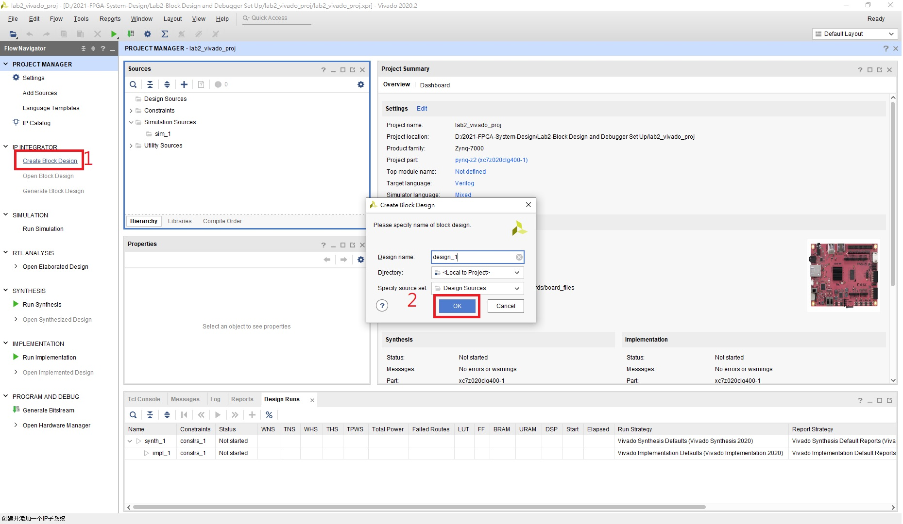
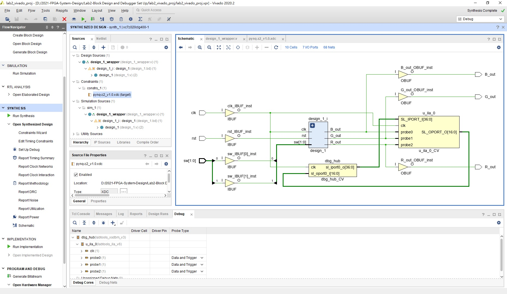

FPGA Design Lab2 - Block Design and Debugger Set Up
===================

# Before the Lab

### What is IP ?

**Intellectual Property** : A functional black box, provided by Xilinx or other third-party providers.

Reference : [Wiki](https://zh.wikipedia.org/wiki/%E5%8D%8A%E5%AF%BC%E4%BD%93IP%E6%A0%B8) ,  [Xilinx](https://www.xilinx.com/products/intellectual-property.html)

# Part 1 - Block Design

## Purpose

學習如何使用 GUI 進行模組化設計

## 1-1 Package IP - 1

在電腦選擇一個自己想要的路徑(不能有中文)，建立IP的資料夾

##### Note : 目的是為了方便管理自己 package 的 IP，資料夾名稱可自己取(必須為英文)。

然後開啟一個 Vivado Project，並加入 `/src/RGB_LED.v` , `/xdc/RGB_LED_ooc.xdc`

接著照著步驟修改 `RGB_LED_ooc.xdc` 的 Properties

> Out-of-context 代表在 Block Desgin 時將這個 IP 視為黑盒子，所以需在設計 IP 時先進行一次合成

上方工具列 `Tools` -> `Create and Package New IP`

選擇剛剛 create 的 IP 資料夾路徑

此時會開啟新的Vivado視窗，接著我們將其做合成

合成完後即可將這個 module 打包成 IP

------

## 1-2 Package IP - 2

再開啟一個 Vivado Project，並只需加入 `/src/PWM_Decoder.v`

接著選上方工具列 `Tools` -> `Create and Package New IP`

和上一 Part 一樣打包成 IP。

-------

## 1-3 Block Design

先開啟一個 Vivado Project，不需加入任何檔案。

開啟後選擇 `PROJECT MANAGER` -> `Settings` -> `IP/Repository`

點選加號，選擇前兩個 Part 所製作的 IP 所在的資料夾。

若剛剛有製作成功，選完資料夾路徑應該會看到偵測到兩個 IP 的畫面。

選擇左方列 `Create Block Design`

選擇上方工具列的`+` (或是在空白處`右鍵` -> `Add IP`)，加入前兩個步驟建立的 IP。

加入成功後 Block Design 應該會長的如下圖

接著要幫電路接線，設定 I/O Ports

在空白處 `右鍵` -> `Create Port`，製作以下 Ports

請照這個命名格式一樣製作 `G_out`、`B_out` 的 Ports

製作完 Ports 後 Block Design 應該會長的如下圖

接著使用滑鼠左鍵點選後連接，將系統連接如下圖

(上方的迴轉鍵可以幫你自動排列 Block Design 使其更加美觀)

接者按下上方打勾的圖案，做 Block Design 初步的驗證

驗證沒問題後，在左方 Design Sources 內的 block design 項目按右鍵，選擇 `Create HDL Wrapper`

這一步是將圖形化的 Blcok Diagram 轉換成 Compiler 可以解讀的硬體描述語言

轉換完成後加入 `/xdc/pynq-z2_v1.0.xdc` 到 project 中

接著即可執行 `Synthesis` -> `Implementation` -> `Generate Bitstream`

> 直接按下 `Generate Bitstream` 其實也會把前面兩步驟都一起做完

------
------

# Part 2 - Set Up Debugger

## Purpose

學習如何設置 Debugger 以觀察電路內訊號

直接沿用上一 Part 的 Project，選擇左方列的 `Synthesis -> Schematic`

若要觀察 RGB LED 給出的三個 Output，

將 Schematic 中 `design_1` 左上角的 `+` 點開並找到這三條訊號線，

按住 Ctrl 選擇這三條線使其變成藍色後，按下左方工具列的 `Set Up Debug`

在 Clock Domain Undefined 的地方右鍵，選擇 `Select Clock Domain`

選擇 `clk_IBUF`

完成後如下圖

接著再重新 Synthesize 一次，再打開 Schematic 會發現多了兩個 Debug Blocks

接著 Generate Bitstream，並燒錄到 FPGA 上

改變 Switch 後再按下畫面中的播放鍵，即可看到訊號的改變

